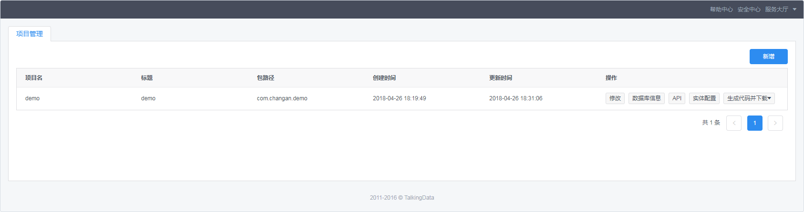

# 火锅底料

几个在重庆的小伙伴，聚在一起研究互联网架构、结合自身经验摸索出来的面向中小IT规模企业的、基础的解决方案，现在处于草创阶段

## 特性

- 根据系统复杂度，即可以采用单体架构开发，也可以采用微服务架构开发
- 以Springboot，SpringCloud为基础
- 除了采用开源中间件外，还原生支持阿里云

## 解决方案

### 软件快速开发平台
- 前端基于Vue + IView
- 后端基于Spring Boot + Mybatis
- 基于Swagger的API文档生成
- 基于Spring Cloud OpenFeign的Restful风格接口声明与实现
- 使用Spring Cloud Netflix Hystrix的熔断机制
- 权限体系基于Spring Security
### 代码配置管理
- 基于Gitlab的代码配置管理平台
### 源代码质量分析
- 基于SonarQube的源代码质量分析平台
### 自动构建
- 基于Gitlab-Runner + Docker + VM Harbor的自动构建体系
### 接口管理和集成测试
- 基于YApi的接口管理和集成测试平台
### 自动部署
- 基于Jenkins的部署平台
### 运维/运营
- 基于携程Apollo的应用动态配置平台
- 基于Piwik的用户行为分析
- 基于ELK的日志分析
- 基于Spring Boot Admin的应用运行监控
- 基于Pinpoint的应用性能监控
- 基于Docker Api + Zabbix的远程监控

## 持续改进

### 软件快速开发平台
- 使用基于Activi的工作流引擎
- 添加基于阿里HSF的集成
### 容器管理和自动部署
- 基于Kubernets的容器管理和自动部署平台
### 运维/运营
- 基于Skywalking的应用新能监控

## 平台使用

### 软件快速开发平台

[Hotpotmaterial Code快速开发平台](https://github.com/hotpotmaterial/code-backend)旨在为团队提供一体化的前后端代码，后端代码基于Spring Boot + Spring Security + Mybatis，前端代码基于Vue + IView

